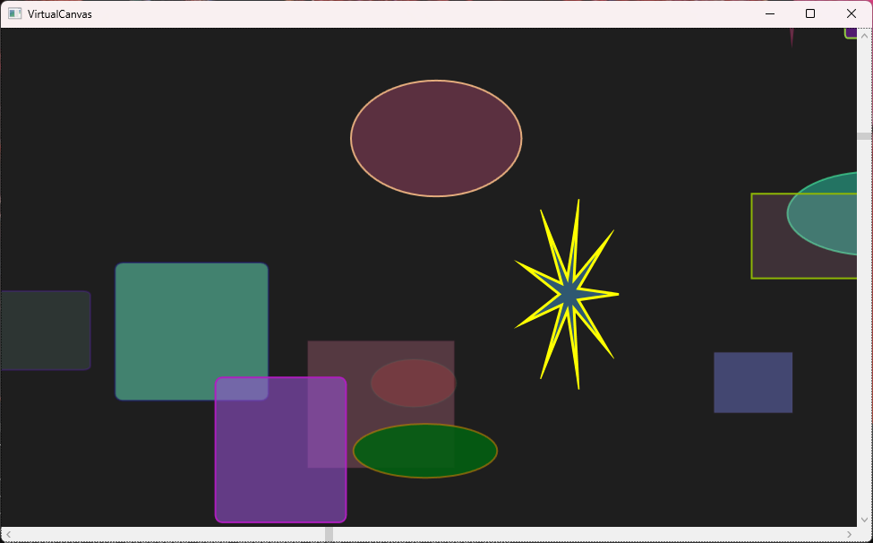

# VirtualCanvas

This project contains a WPF control that provides a nice 2-dimensional virtual canvas using an efficient QuadTree index and a demo that shows how to use it.

See [Demo Video](https://lovettsoftwarestorage.blob.core.windows.net/videos/VirtualCanvas.mp4)

The demo creates a whopping 100,000 objects that are represented visually as simple shapes in WPF like
Ellipse, Rectangle, and Polygon.  These shapes are spread out over a large 100,000 x 100,000 pixel canvas
and the VirtualCanvas makes this perform nicely as you scroll through the data.

You could imagine that creating 100,000 WPF shapes would take a long time and use a lot of memory, but with VirtualCanvas the memory usage is the
very reasonable.

This is what it looks like, notice the scroll bar thumbs are tiny which shows you that the canvas is huge but scrolling performance is smooth no
matter where you scroll to.

